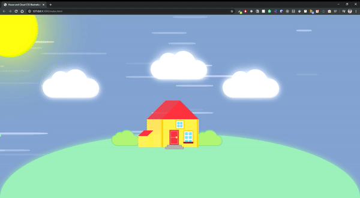

# 🏠 CSS House With Clouds ☁️

## Content

- [About](#about)
- [Demo](#demo)
- [Contribute](#contribute)

## About

An Illustration of a house on a hill with clouds and sun. The wind is blowing past making the clouds and bushes move.

## Demo

## Contribute

Built as a personal project for learning experience and fun. Please feel free to contribute by creating issues, submitting new pull requests!