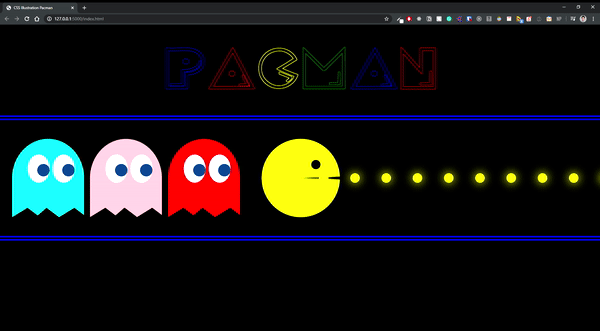

# 🎮 CSS Pacman & Ghost 🎮

## Content

- [About](#about)
- [Demo](#demo)
- [Notes](#notes)
- [Contribute](#contribute)

## About

Creating an Illustration of a Pacman! Fun one to try out

## Demo

## Notes

> **Responsive**: False

> **Refactored Code**: False

**Font**: https://www.1001fonts.com/pacfont-font.html

Credit goes to https://www.youtube.com/watch?v=AUAbh6zti5Q&t=1348s for the pacman top and bottom design idea!

## Contribute

Built as a personal project for learning experience and fun. Please feel free to contribute by creating issues, submitting new pull requests!