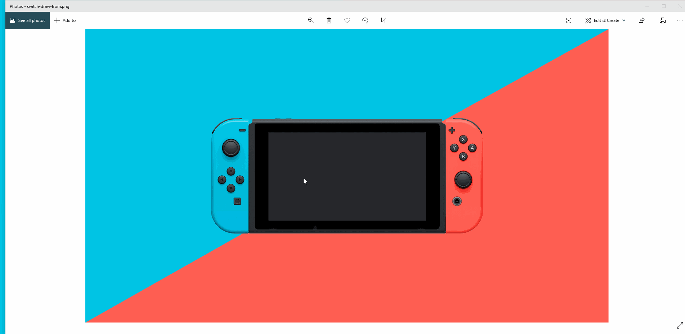

# 🎮 CSS Nintendo Switch 🎮

## Content

- [About](#about)
- [Demo](#demo)
- [Contribute](#contribute)

## About

Creating an Illustration of a Nintendo Switch! One of the more difficult ones but also very fun to do.

## Demo

## Contribute

Built as a personal project for learning experience and fun. Please feel free to contribute by creating issues, submitting new pull requests!