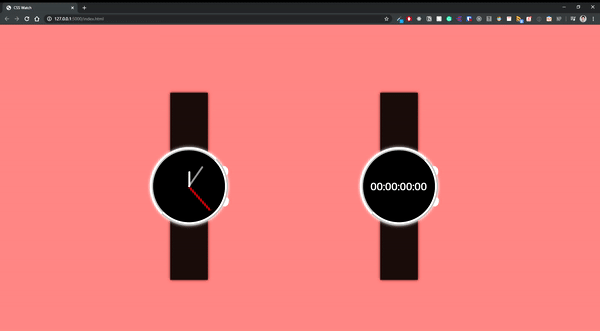

# ⏱ CSS Watch ⌚️

## Content

- [About](#about)
- [Demo](#demo)
- [Notes](#notes)
- [Contribute](#contribute)

## About

CSS Illustration of a analog watch and stopwatch

## Demo

## Notes

> **Responsive**: False

> **Refactored Code**: False

Credit goes to [CSS Animation Rocks - Clocks Tutorial](https://cssanimation.rocks/clocks/) for the great tutorial on css watch face rotation

## Contribute

Built as a personal project for learning experience and fun. Please feel free to contribute by creating issues, submitting new pull requests!